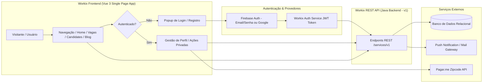
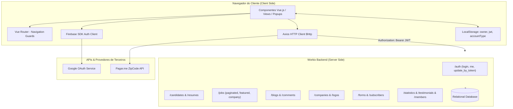
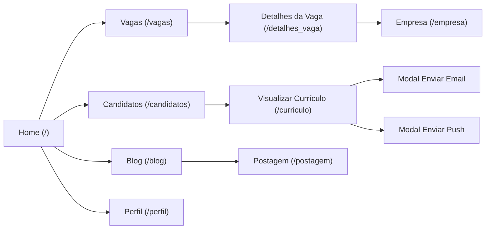
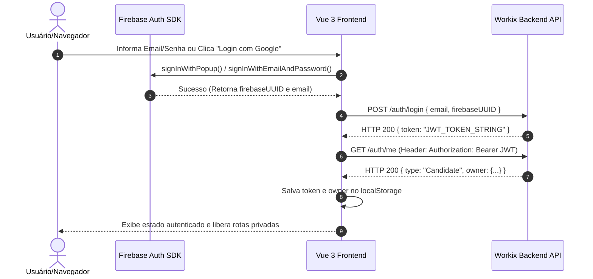
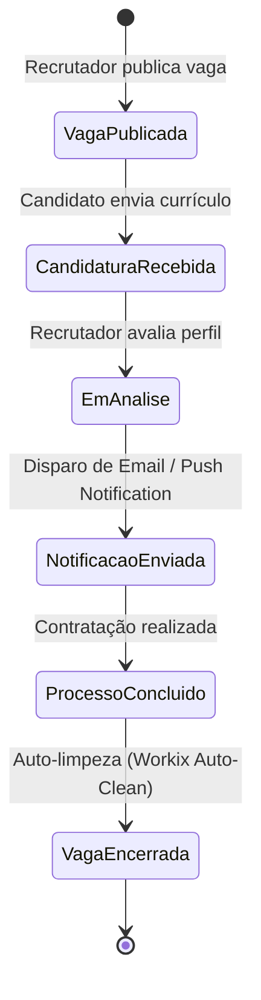

# SPECIFICATION.md
## Documento Mestre para Specification-Driven Development (SDD)

---

# 1. VISÃO GERAL DO SISTEMA

## 1.1 Objetivo
O **Workix** é uma plataforma web responsiva de anúncio e recrutamento de empregos, conectando candidatos a emprego e recrutadores/empresas de forma gratuita, transparente e direta. A solução visa eliminar processos seletivos engessados, burocráticos e opacos, fornecendo feedback contínuo em cada etapa da seleção e automatizando a gestão de currículos, vagas, depoimentos e interações de candidatos e empresas.

### Problema de negócio
- Processos seletivos tradicionais são cansativos, demorados e sem transparência para os candidatos.
- Falta de feedback recorrente aos candidatos após a candidatura (o "silêncio" nos processos seletivos).
- Vagas fantasmas ou desatualizadas mantidas ativas em bancos de dados por longos períodos.
- Custos elevados cobrados por plataformas tradicionais que vendem anúncios VIPs ou acessos pagos restritivos.
- Interfaces inacessíveis ou mal adaptadas a diferentes dispositivos (desktops, tablets e smartphones).

### Público-alvo
- **Candidatos / Trabalhadores**: Profissionais buscando vagas de emprego (Freelance, Meio Período, Tempo Integral, Estágio, Trabalho Voluntário), desejando cadastrar e gerenciar seus currículos e receber alertas/notificações sobre os processos.
- **Recrutadores / Empresas**: Organizações e recrutadores que necessitam publicar vagas, buscar perfis de candidatos qualificados e gerenciar o recrutamento com comunicação direta via Email e Push Notification.
- **Visitantes / Leitores**: Usuários que navegam pelo portal em busca de artigos do blog de carreira, estatísticas de contratação, depoimentos e informações institucionais.

### Benefícios
1. **Transparência e Feedback Contínuo**: Notificações diretas via e-mail e push notification para manter o candidato informado.
2. **Acesso 100% Gratuito**: Sem venda de assinaturas VIP ou restrição de visualização de vagas e candidatos.
3. **Plataforma Responsiva Multi-Dispositivo**: Experiência consistente em desktops, tablets e dispositivos móveis.
4. **Auto-limpeza e Validade de Vagas**: Algoritmos de ciclo de vida que encerram vagas concluídas ou expiradas.
5. **Autenticação Flexível e Integrada**: Suporte a login nativo (Email/Senha) e autenticação social via Firebase (Google Provider).
6. **Autocompletar de Endereço via CEP**: Integração com API de CEP (Pagar.me) para simplificar o cadastro de perfil.

## 1.2 Escopo

### Incluído
- Módulo de Autenticação e Gestão de Usuários (Candidato e Recrutador/Empresa) via Firebase Auth e Backend REST API JWT.
- Módulo de Perfil do Usuário com autocompletar de CEP e atualização de dados pessoais, contatos e localização.
- Módulo de Vagas: Listagem paginada, busca por palavras-chave, filtros por nível de carreira, presença, tipo de vaga, localização, experiência e faixa salarial, exibição de vaga destaque aleatória e detalhes completos da vaga.
- Módulo de Cadastro de Vagas (Post Job) e Cadastro de Empresa.
- Módulo de Currículos: Listagem paginada de candidatos, visualização detalhada de currículo (experiências, formação acadêmica, habilidades e dados de contato), cadastro de currículo (Post Resume) e envio de notificações diretas (Mail e Push).
- Módulo de Empresas: Listagem de logos em destaque, página da empresa com detalhes, localização no mapa (Google Maps) e vagas relacionadas.
- Módulo de Blog e Notícias: Listagem paginada de posts, barra lateral com categorias, arquivos temporais, posts recentes e comentários recentes, leitura de postagem individual, galeria de imagens, compartilhamento social e envio de novos comentários com validação.
- Módulo de Estatísticas e Métricas operacionais em tempo real no dashboard inicial.
- Módulo de Depoimentos e Equipe Workix.
- Formulários institucionais de Contato (Fale Conosco) e Inscrição de Boletim Informativo (Newsletter).
- Página de Opções (Design System / Componentes do Template).

### Não Incluído
- Processamento de pagamento interno (a plataforma é totalmente gratuita).
- Chat em tempo real (websockets) entre recrutador e candidato (utilizam-se notificações assíncronas via E-mail/Push).
- Execução de testes de código de programação integrados à vaga na própria plataforma.

## 1.3 Fluxo Geral



---

# 2. ARQUITETURA

## 2.1 Visão Arquitetural

### Estilo Arquitetural
Single Page Application (SPA) reativa desenvolvida em **Vue 3 (Composition API & Options API)** comunicando-se de forma assíncrona via HTTP/REST (JSON) com um backend desacoplado Java EE / Jakarta EE em servidor local/remoto (`http://localhost:8080/workix/services/v1`). A autenticação de identidade é delegada ao **Firebase Authentication SDK**, e a autorização de sessão interna é mantida via tokens **JWT (JSON Web Token)** armazenados no `localStorage` do navegador.

### Tecnologias

| Camada | Tecnologia | Versão | Função / Descrição |
| :--- | :--- | :--- | :--- |
| **Frontend Framework** | Vue.js | ^3.2.13 | Framework reativo principal para construção da interface de usuário |
| **Roteamento** | Vue Router | ^4.0.3 | Gerenciamento de rotas e navegação client-side |
| **Gerenciamento de Estado** | Vuex | ^4.0.0 | Armazenamento de estado centralizado (preparado para módulos) |
| **Cliente HTTP** | Axios | ^0.27.2 | Execução de requisições AJAX/REST para o backend e APIs externas |
| **Autenticação Identity** | Firebase SDK | ^9.8.3 | Autenticação de usuários (Email/Senha e OAuth Google Provider) |
| **Notificações UI** | Vue Toastification | ^2.0.0-rc.5 | Exibição de alertas e mensagens de feedback (Toasts) |
| **Componentes de Data** | @vuepic/vue-datepicker | ^3.2.2 | Seleção interativa de datas nos formulários |
| **Estilização & Grid** | Bootstrap CSS / Custom CSS | 3.x / CSS3 | Sistema de grid de 12 colunas, responsividade e componentes visuais |
| **Ícones & Tipografia** | FontAwesome | 4.x | Biblioteca de ícones vetoriais |
| **Manipulação DOM / Legacy**| jQuery | ^1.11.2 | Suporte aos modais, animações e plugins do template legacy |
| **API Externa de Endereços** | Pagar.me Zipcode API | v1 | Autocompletar de dados de endereço via CEP |

## 2.2 Diagrama Arquitetural



## 2.3 Estrutura de Módulos

```
src/
├── App.vue                         # Componente raiz da aplicação
├── main.js                         # Bootstrap do Vue, Axios, Toast, Firebase e Vuex
├── assets/                         # Arquivos estáticos de estilo e imagens
├── router/
│   └── index.js                    # Definição de rotas, navegação e route guards
├── store/
│   └── index.js                    # Store global Vuex (State, Mutators, Actions)
├── components/                     # Componentes reativos reutilizáveis
│   ├── PageLoader.vue              # Spinner/Loader de carregamento de página
│   ├── NavBar.vue                  # Menu de navegação superior deslizante
│   ├── HeaderBar.vue               # Cabeçalho com logo e barra de busca global
│   ├── FooterWrapper.vue           # Rodapé da aplicação e formulário de boletim
│   ├── ContactsWrapper.vue         # Formulário de contato "Deixe-nos uma mensagem"
│   ├── LoginPopup.vue              # Modal popup de Login (Email/Senha e Google)
│   ├── RegisterPopup.vue           # Modal popup de Registro (Candidato vs Recrutador)
│   ├── HaveAnAccount.vue           # Banner auxiliar de chamada para login/registro
│   ├── SliderWrapper.vue           # Banner deslizante da página inicial
│   ├── IndexModal.vue              # Modal informativo / Boas-vindas
│   ├── JobsWrapper.vue             # Card wrapper de vagas em destaque na Home
│   ├── JobsList.vue                # Lista paginada de vagas com barra lateral de filtros
│   ├── CandidatesList.vue          # Lista paginada de candidatos com filtros
│   ├── CompaniesWrapper.vue        # Grid de empresas e seus logos
│   ├── StatsWrapper.vue            # Estatísticas operacionais (contadores)
│   ├── HowItWorks.vue              # Seção explicativa "Como funciona"
│   ├── MobileApp.vue               # Chamada para download do aplicativo móvel
│   ├── PricingWrapper.vue          # Planos explicativos (100% grátis)
│   ├── TestimonialsWrapper.vue     # Carrossel de depoimentos
│   ├── TestimonialMessage.vue      # Item de depoimento individual
│   ├── BlogWrapper.vue             # Carrossel de notícias recentes na Home
│   ├── TeamWrapper.vue             # Seção de apresentação da equipe
│   ├── TeamMember.vue              # Card individual de membro da equipe
│   ├── ClientsWrapper.vue          # Grid de clientes/parceiros
│   ├── MessageModalMail.vue        # Modal de envio de e-mail ao candidato
│   ├── MessageModalPush.vue        # Modal de envio de notificação push ao candidato
│   ├── blogs/
│   │   ├── BlogPost.vue            # Card de post do blog
│   │   └── BlogSideBar.vue         # Barra lateral do blog (Categorias, Arquivos, Recentes)
│   ├── jobs/
│   │   ├── DefaultJob.vue          # Card padrão de vaga
│   │   └── FeaturedJob.vue         # Card de vaga destaque
│   └── post_jobs/
│       ├── JobDetailsForm.vue      # Form de detalhes da vaga (Post Job)
│       └── CompanyDetailsForm.vue   # Form de detalhes da empresa (Post Job)
└── views/                          # Visualizações (Páginas principais)
    ├── IndexView.vue               # Página Inicial (Home)
    ├── AboutView.vue               # Página Sobre Nós / História / Status do projeto
    ├── JobsView.vue                # Página de Vagas (Com Filtros e Paginação)
    ├── Jobs2View.vue               # Página de Vagas (Sem Filtros)
    ├── JobDetailsView.vue          # Página de Detalhes da Vaga
    ├── PostJobView.vue             # Página de Cadastro de Nova Vaga
    ├── CandidatesView.vue          # Página de Candidatos (Com Filtros e Paginação)
    ├── Candidates2View.vue         # Página de Candidatos (Sem Filtros)
    ├── ResumeView.vue              # Página de Visualização Completa de Currículo
    ├── PostResumeView.vue          # Página de Cadastro de Currículo
    ├── CompanyView.vue             # Página de Detalhes da Empresa / Vagas da Empresa
    ├── ProfileView.vue             # Página de Perfil do Usuário e Edição de Dados
    ├── BlogView.vue                # Página do Blog (Listagem de Notícias Paginada)
    ├── PostView.vue                # Página de Leitura de Postagem do Blog e Comentários
    ├── TestimonialsView.vue        # Página de Depoimentos
    ├── OptionsView.vue             # Página de Elementos do Template (Design System)
    ├── SearchView.vue              # Página de Resultados de Busca
    └── NotFoundView.vue            # Página de Erro 404 (Rota não encontrada)
```

---

# 3. REGRAS DE NEGÓCIO

### BR-001: Autenticação Dupla (Firebase + Backend Workix)
- **Nome**: Sincronização de Autenticação Firebase com JWT Workix
- **Descrição**: O usuário se autentica primariamente no Firebase Authentication (seja por Email/Senha ou OAuth Google). Ao obter o `uid` e o `email` do Firebase, o sistema invoca a API do Workix (`POST /auth/login` ou `POST /vue/create_candidate`) enviando o `firebaseUUID` e o `email`. O backend valida o UUID e retorna um token JWT de sessão Workix.
- **Motivação**: Garantir a integração transparente com autenticação social segura sem armazenar senhas brutas no banco do Workix.
- **Implementação**:
  - **Arquivo**: [LoginPopup.vue](file:///c:/Packsys/NetBeansProjects/workix-frontend-vue/src/components/LoginPopup.vue), [RegisterPopup.vue](file:///c:/Packsys/NetBeansProjects/workix-frontend-vue/src/components/RegisterPopup.vue)
  - **Método**: `onAuthStateChanged()`, `logginInWorkix()`, `createAccountInWorkix()`
  - **Entradas**: `email`, `firebaseUUID`, `accountType` ("Candidate" ou "Company")
  - **Processamento**: Executa o login no Firebase, obtém as credenciais Firebase, envia requisição POST para `/auth/login` ou `/vue/create_candidate`, salva `localStorage.jwt`, `localStorage.owner` e `localStorage.accountType`.
  - **Saídas**: Token JWT e objeto do proprietário (Candidato/Empresa) no `localStorage`.
  - **Exemplo**: Usuário faz login com Google -> Firebase gera UUID `abc123xyz` -> Envia para `/auth/login` -> Recebe JWT -> Salva no `localStorage`.
  - **Impacto**: Bloqueia ou concede acesso a endpoints protegidos que exigem o cabeçalho `Authorization: Bearer <jwt>`.

---

### BR-002: Identificação Única por CPF / CNPJ
- **Nome**: Validação de Cadastro Único por Documento
- **Descrição**: Candidatos obrigatoriamente informam CPF (mínimo de 11 dígitos numéricos) e data de nascimento. Empresas/Recrutadores obrigatoriamente informam CNPJ. O sistema vincula cada cadastro 1 a 1 com o documento.
- **Motivação**: Impedir a criação de perfis duplicados ou falsos, mantendo a integridade da base de dados.
- **Implementação**:
  - **Arquivo**: [RegisterPopup.vue](file:///c:/Packsys/NetBeansProjects/workix-frontend-vue/src/components/RegisterPopup.vue)
  - **Método**: `registerWithGoogle()`, `registerWithEmailPassword()`
  - **Entradas**: `cpf` (string/number), `cnpj` (string), `birthDate` (Date)
  - **Processamento**: Verifica o tamanho de `cpf` (`>= 11`) e a presença de `birthDate` antes de permitir o avanço no cadastro de candidatos.
  - **Saídas**: Payload sanitizado enviado para `/vue/create_candidate`.
  - **Exemplo**: Cadastro de candidato sem CPF válido trava a submissão no cliente.
  - **Impacto**: Garante dados limpos para os recrutadores.

---

### BR-003: Autocompletar de Endereço via CEP (Zipcode API)
- **Nome**: Preenchimento Automático de Localização por CEP
- **Descrição**: Na tela de Perfil (`ProfileView.vue`), ao alterar o campo CEP (`zipLocale`), o sistema extrai os dígitos numéricos e consulta a API da Pagar.me (`https://api.pagar.me/1/zipcodes/{zipcode}`).
- **Motivação**: Facilitar o preenchimento de endereço pelo usuário e evitar erros de digitação de cidade e estado.
- **Implementação**:
  - **Arquivo**: [ProfileView.vue](file:///c:/Packsys/NetBeansProjects/workix-frontend-vue/src/views/ProfileView.vue#L291-L304)
  - **Método**: `getAddressFromZip(target)`
  - **Entradas**: `zipLocale` (ex: "01001-000")
  - **Processamento**: `zipLocale.match(/\d+/g)` -> Requisição GET para a API do Pagar.me com a chave `process.env.VUE_APP_PAGARME_KEY`.
  - **Saídas**: Atualização automática dos dados `streetLocale`, `neighLocale`, `cityLocale`, `estateLocale`.
  - **Exemplo**: CEP `01001000` -> Preenche Rua Praça da Sé, Bairro Sé, Cidade São Paulo, Estado SP.
  - **Impacto**: Melhora significativamente a experiência do usuário e a consistência dos dados geográficos.

---

### BR-004: Envio de Notificações a Candidatos (Mail / Push Notification)
- **Nome**: Envio de Mensagens de Recrutamento
- **Descrição**: Um recrutador/empresa pode enviar uma mensagem via E-mail ou Push Notification a um candidato através do perfil do candidato (`ResumeView.vue`).
- **Motivação**: Manter canal direto de comunicação entre empresa e candidato sem expor contatos pessoais diretamente.
- **Implementação**:
  - **Arquivo**: [MessageModalMail.vue](file:///c:/Packsys/NetBeansProjects/workix-frontend-vue/src/components/MessageModalMail.vue), [MessageModalPush.vue](file:///c:/Packsys/NetBeansProjects/workix-frontend-vue/src/components/MessageModalPush.vue)
  - **Método**: `notify()`
  - **Entradas**: `user` (objeto do usuário candidato), `title`, `message`, `type` ("mail" ou "push")
  - **Processamento**: Remove os campos de timestamp (`createdAt`, `updatedAt`) do objeto `user`, monta a estrutura `{ user, type, title, message }` e dispara POST para `http://localhost:8080/workix/services/v1/candidates/notify`.
  - **Saídas**: Exibe aviso Toast em caso de sucesso (HTTP 200) ou falha e fecha a janela modal via jQuery (`$("#close").click()`).
  - **Exemplo**: Notificação push enviada com o título "Convite para Entrevista" e conteúdo com instruções.
  - **Impacto**: Proporciona o feedback transparente exigido pelo conceito do produto Workix.

---

### BR-005: Comentários em Posts do Blog
- **Nome**: Submissão de Comentários com Validação de Email
- **Descrição**: Qualquer visitante pode comentar em uma postagem do blog informando Nome, Email e Mensagem.
- **Motivação**: Engajamento da comunidade e discussão sobre mercado de trabalho.
- **Implementação**:
  - **Arquivo**: [PostView.vue](file:///c:/Packsys/NetBeansProjects/workix-frontend-vue/src/views/PostView.vue#L251-L264)
  - **Método**: `sendAComment()`, `validateEmail()`
  - **Entradas**: `name`, `email`, `message`, `postId`
  - **Processamento**: Valida a sintaxe do e-mail com regex. Se for válido, dispara POST para `/comments/blog` com os dados. Em seguida, recarrega o post chamando `getPost(this.postId)` para exibir o novo comentário na lista.
  - **Saídas**: Toast de sucesso ("Enviado com Sucesso!") e atualização imediata do contador de comentários.
  - **Exemplo**: Email inválido "teste@com" exibe Toast de alerta "Por favor digite um email válido!".
  - **Impacto**: Garante que apenas comentários com e-mails formatados sejam persistidos.

---

### BR-006: Inscrição em Boletim Informativo (Newsletter)
- **Nome**: Submissão de Inscrição no Newsletter
- **Descrição**: O rodapé da aplicação em todas as páginas possui um formulário de boletim informativo.
- **Motivação**: Captura de e-mails para envio de novidades sobre vagas.
- **Implementação**:
  - **Arquivo**: [FooterWrapper.vue](file:///c:/Packsys/NetBeansProjects/workix-frontend-vue/src/components/FooterWrapper.vue#L66-L78)
  - **Método**: `sendToSubscribers()`
  - **Entradas**: `email`
  - **Processamento**: Valida regex de email -> POST para `/subscribers/subscribe` com `{ email }`.
  - **Saídas**: Se `data.subscribed` for verdadeiro, exibe Toast Success com a mensagem do servidor; caso contrário, exibe Toast Info.
  - **Exemplo**: E-mail já inscrito exibe Toast Info "Email já cadastrado".
  - **Impacto**: Mantém a base de assinantes atualizada de forma segura.

---

# 4. CASOS DE USO

## UC-001: Autenticar Usuário na Plataforma
- **Nome**: Autenticação de Usuário (Login)
- **Objetivo**: Permitir que candidatos e recrutadores acessem suas contas na plataforma.
- **Atores**: Candidato, Recrutador.
- **Pré-condições**: Usuário ter uma conta previamente registrada.
- **Pós-condições**: Sessão ativada, token JWT salvo no `localStorage`, estado de login atualizado para `isLoggedIn = true`.

### Fluxo Principal
1. O usuário clica no link "Login" no menu superior ([NavBar.vue](file:///c:/Packsys/NetBeansProjects/workix-frontend-vue/src/components/NavBar.vue)).
2. O modal de login ([LoginPopup.vue](file:///c:/Packsys/NetBeansProjects/workix-frontend-vue/src/components/LoginPopup.vue)) é exibido.
3. O usuário digita seu e-mail e senha e clica em "Entrar".
4. O sistema autentica no Firebase via `signInWithEmailAndPassword`.
5. O sistema obtém o `email` e `uid` do Firebase e faz uma requisição `POST /auth/login` para o backend Workix.
6. O backend aceita as credenciais e retorna um token JWT.
7. O sistema faz uma requisição `GET /auth/me` enviando o token JWT no cabeçalho `Authorization: Bearer <token>`.
8. O backend retorna os dados completos do proprietário (`owner`) e o tipo de conta (`Candidate` ou `Company`).
9. O sistema grava no `localStorage`: `owner`, `jwt` e `accountType`.
10. O modal de login é fechado e uma mensagem de boas-vindas (Toast) é exibida.

### Fluxos Alternativos
- **A1. Login com Google**:
  1. No passo 3, o usuário clica em "Entrar com Google".
  2. O popup de autenticação do Google é aberto via `signInWithPopup`.
  3. O usuário autoriza a conta no Google.
  4. O fluxo prossegue a partir do passo 5.

### Fluxos de Exceção
- **E1. Credenciais Inválidas no Firebase**:
  1. No passo 4, o Firebase rejeita o e-mail/senha.
  2. O modal é fechado e exibe uma mensagem Toast de erro: "Ocorreu Algum problema ao fazer login!".
  3. A senha é limpa e o usuário permanece não autenticado.
- **E2. Falha de Comunicação com o Backend Workix**:
  1. No passo 5 ou 7, a API do Workix falha (HTTP 500 ou indisponível).
  2. Um aviso Toast de erro é apresentado ao usuário.

---

## UC-002: Atualizar Perfil e Endereço do Candidato
- **Nome**: Gestão de Perfil de Usuário
- **Objetivo**: Permitir a edição de dados pessoais, contatos e endereço do candidato.
- **Atores**: Candidato Autenticado.
- **Pré-condições**: Usuário estar autenticado com token JWT armazenado no `localStorage`.
- **Pós-condições**: Dados atualizados no banco de dados backend e no perfil do usuário.

### Fluxo Principal
1. O usuário acessa a página `/perfil` ([ProfileView.vue](file:///c:/Packsys/NetBeansProjects/workix-frontend-vue/src/views/ProfileView.vue)).
2. O sistema faz a chamada `GET /auth/me` com o token JWT e carrega os campos de Usuário, Candidato, Contato e Localização nos inputs da tela.
3. O usuário altera seus dados (ex: Nome, Celular, CEP).
4. Ao alterar o campo CEP, a função `getAddressFromZip` é ativada, consultando a API do Pagar.me e preenchendo automaticamente Rua, Bairro, Cidade e Estado.
5. O usuário preenche o número da residência e clica no botão "Salvar".
6. O sistema constrói a estrutura da payload contendo os objetos aninhados `candidate`, `user`, `contact` e `locale`.
7. O sistema envia a requisição `PUT /vue/update_by_token` com o cabeçalho `Authorization: Bearer <token>`.
8. O backend atualiza os registros e retorna resposta de sucesso (HTTP 200).
9. O sistema exibe Toast "Dados Salvos com Sucesso!" e recarrega a página de perfil.

---

## UC-003: Visualizar e Filtrar Vagas de Emprego
- **Nome**: Consulta e Filtragem de Vagas
- **Objetivo**: Buscar e listar vagas de emprego com base em parâmetros de página, limite e filtros.
- **Atores**: Candidato, Visitante.
- **Pré-condições**: Nenhuma.
- **Pós-condições**: Exibição da lista de vagas correspondentes e do paginador.

### Fluxo Principal
1. O usuário navega para a página `/vagas` ([JobsView.vue](file:///c:/Packsys/NetBeansProjects/workix-frontend-vue/src/views/JobsView.vue)).
2. O sistema lê os parâmetros de URL `pagina` e `limite` (padrão: `pagina=1`, `limite=10`).
3. O sistema faz a requisição `GET /jobs/paginated?page=1&limit=10` para o backend.
4. Concomitantemente, o componente [JobsList.vue](file:///c:/Packsys/NetBeansProjects/workix-frontend-vue/src/components/JobsList.vue) faz a requisição `GET /jobs/random_featured` para obter a vaga em destaque na barra lateral.
5. A lista de vagas é renderizada com seus badges correspondentes ao tipo de vaga (`FULLTIME`, `PARTTIME`, `FREELANCE`, `TEMPORARY`, `INTERNSHIP`).
6. O paginador exibe o número da página atual, botão "Anterior" (se `currentPage > 1`) e botão "Próxima" (se `currentPage < totalPages`).

---

## UC-004: Enviar Mensagem/Notificação ao Candidato
- **Nome**: Notificação de Recrutamento
- **Objetivo**: Enviar e-mail ou notificação push para um candidato específico a partir de seu currículo.
- **Atores**: Recrutador / Empresa.
- **Pré-condições**: Estar visualizando a página de currículo do candidato ([ResumeView.vue](file:///c:/Packsys/NetBeansProjects/workix-frontend-vue/src/views/ResumeView.vue)).
- **Pós-condições**: Notificação processada e enviada via serviço do backend Workix.

### Fluxo Principal
1. O recrutador clica no link "Enviar Email" ou "Enviar Mensagem Celular" na barra lateral de contato do currículo.
2. O modal correspondente ([MessageModalMail.vue](file:///c:/Packsys/NetBeansProjects/workix-frontend-vue/src/components/MessageModalMail.vue) ou [MessageModalPush.vue](file:///c:/Packsys/NetBeansProjects/workix-frontend-vue/src/components/MessageModalPush.vue)) é aberto.
3. O recrutador preenche os campos "Título" e "Conteúdo da Mensagem".
4. O recrutador clica em "Enviar Mensagem".
5. O sistema remove atributos temporais do objeto `user` e envia requisição `POST /candidates/notify` com a payload `{ user, type: "mail"|"push", title, message }`.
6. Ao receber resposta HTTP 200, o modal é fechado automaticamente e é exibida mensagem Toast informando o envio com sucesso.

---

# 5. MODELO DE DOMÍNIO

### Entidade: User (Usuário)
- **Responsabilidade**: Representar as credenciais básicas de acesso e autenticação no sistema.
- **Atributos**:
  - `id` (Long, Obrigatório) - Identificador único do usuário no banco de dados.
  - `uuid` (String, Obrigatório) - UUID interno do sistema.
  - `email` (String, Obrigatório) - Endereço de e-mail do usuário.
  - `active` (Boolean, Obrigatório) - Status da conta (ativo/inativo).
  - `firebaseUUID` (String, Obrigatório) - Identificador único retornado pelo Firebase Auth.
  - `firebaseMessageToken` (String, Opcional) - Token de mensageria FCM para notificações Push.
- **Relacionamentos**: Usuário 1:1 Candidato, Usuário 1:1 Empresa.

---

### Entidade: Candidate (Candidato)
- **Responsabilidade**: Manter as informações do perfil do profissional candidato a vagas.
- **Atributos**:
  - `id` (Long, Obrigatório) - Identificador único do candidato.
  - `uuid` (String, Obrigatório) - UUID do candidato.
  - `name` (String, Obrigatório) - Nome completo do candidato.
  - `cpf` (Long / String, Obrigatório) - Cadastro de Pessoa Física.
  - `birthDate` (Date / String, Obrigatório) - Data de nascimento.
- **Relacionamentos**:
  - Candidato 1:1 User
  - Candidato 1:1 Contact
  - Candidato 1:1 Locale
  - Candidato 1:1 Resume
- **Regras Associadas**: BR-001, BR-002, BR-003.

---

### Entidade: Company (Empresa / Recrutador)
- **Responsabilidade**: Armazenar os dados cadastrais da empresa recrutadora.
- **Atributos**:
  - `id` (Long, Obrigatório) - ID da empresa.
  - `name` (String, Obrigatório) - Razão social ou nome fantasia da empresa.
  - `cnpj` (String, Opcional) - Cadastro Nacional de Pessoa Jurídica.
  - `segment` (String, Opcional) - Ramo ou segmento de atuação.
  - `description` (String, Opcional) - Descrição detalhada da empresa.
  - `logo` (String, Opcional) - URL do logotipo da empresa.
- **Relacionamentos**:
  - Empresa 1:1 User
  - Empresa 1:1 Contact
  - Empresa 1:1 Locale
  - Empresa 1:N Job (Vagas)
  - Empresa 1:N Media (Redes Sociais)

---

### Entidade: Job (Vaga de Emprego)
- **Responsabilidade**: Descrever os detalhes, requisitos e benefícios de uma oportunidade de trabalho.
- **Atributos**:
  - `id` (Long, Obrigatório) - ID da vaga.
  - `title` (String, Obrigatório) - Título da vaga (ex: "Web Designer").
  - `description` (String, Obrigatório) - Descrição detalhada das atividades.
  - `requirement` (String, Opcional) - Requisitos da vaga.
  - `benefits` (String, Opcional) - Benefícios oferecidos.
  - `jobType` (Enum / String, Obrigatório) - Tipo de contratação (`FULLTIME`, `PARTTIME`, `FREELANCE`, `TEMPORARY`, `INTERNSHIP`).
  - `minPayment` (Double, Obrigatório) - Valor mínimo de remuneração.
  - `maxPayment` (Double, Obrigatório) - Valor máximo de remuneração.
  - `featured` (Boolean, Opcional) - Indicador se a vaga é destaque.
- **Relacionamentos**: Vaga N:1 Empresa.

---

### Entidade: Resume (Currículo)
- **Responsabilidade**: Estruturar o currículo profissional do candidato.
- **Atributos**:
  - `id` (Long, Obrigatório) - ID do currículo.
  - `objective` (String, Obrigatório) - Objetivo profissional (ex: "Desenvolvedor Front-end").
  - `content` (String, Obrigatório) - Resumo/conteúdo do currículo.
  - `carrerLevel` (String, Opcional) - Nível de carreira (`Junior`, `Middle`, `Senior`, `Expert`).
  - `presence` (String, Opcional) - Modelo de trabalho (`Remote`, `Office`, `Relocation`, `Travel a lot`).
- **Relacionamentos**:
  - Currículo 1:1 Candidate
  - Currículo 1:N Experience (Experiências Profissionais)
  - Currículo 1:N Education (Formações Acadêmicas)
  - Currículo 1:N Skill (Habilidades do Candidato)

---

### Entidade: Experience (Experiência Profissional)
- **Responsabilidade**: Armazenar o histórico de empregos anteriores do candidato.
- **Atributos**:
  - `id` (Long, Obrigatório)
  - `employerName` (String, Obrigatório) - Nome do empregador/empresa.
  - `jobTitle` (String, Obrigatório) - Cargo ocupado.
  - `description` (String, Opcional) - Descrição das responsabilidades.
  - `startDate` (Date, Obrigatório) - Data de início.
  - `endDate` (Date, Opcional) - Data de término (null se for o emprego atual).

---

### Entidade: Education (Formação Acadêmica)
- **Responsabilidade**: Registrar o histórico educacional do candidato.
- **Atributos**:
  - `id` (Long, Obrigatório)
  - `schoolName` (String, Obrigatório) - Nome da instituição de ensino.
  - `qualification` (String, Obrigatório) - Grau/Título (ex: "Engenheiro de Software").
  - `description` (String, Opcional) - Detalhes/conquistas.
  - `startDate` (Date, Obrigatório) - Data de início.
  - `endDate` (Date, Opcional) - Data de conclusão.

---

### Entidade: Contact & Locale (Contato e Localização)
- **Contact Atributos**: `mobilePhone` (Long/String), `email` (String).
- **Locale Atributos**: `zipCode` (Long/String), `street` (String), `number` (String), `neighborhood` (String), `city` (String), `estate` (String).

---

# 6. BANCO DE DADOS

O banco de dados relacional é mantido pelo servidor backend Java Workix (`http://localhost:8080/workix/services/v1`). A especificação a seguir descreve a estrutura exata das tabelas mapeadas:

### Tabela `USERS`
| Campo | Tipo | Nulo | Chave | Descrição |
| :--- | :--- | :--- | :--- | :--- |
| `ID` | BIGINT / NUMBER | NÃO | PK | Identificador do Usuário |
| `UUID` | VARCHAR(255) | NÃO | UNIQUE | UUID interno |
| `EMAIL` | VARCHAR(255) | NÃO | UNIQUE | Email do usuário |
| `ACTIVE` | BOOLEAN | NÃO | - | Status da conta |
| `FIREBASE_UUID` | VARCHAR(255) | NÃO | UNIQUE | UUID gerado pelo Firebase |
| `FIREBASE_MESSAGE_TOKEN` | VARCHAR(500) | SIM | - | Token FCM para notificações push |

### Tabela `CANDIDATE`
| Campo | Tipo | Nulo | Chave | Descrição |
| :--- | :--- | :--- | :--- | :--- |
| `ID` | BIGINT / NUMBER | NÃO | PK | Identificador do Candidato |
| `UUID` | VARCHAR(255) | NÃO | UNIQUE | UUID do candidato |
| `USER_ID` | BIGINT / NUMBER | NÃO | FK | Chave estrangeira para `USERS(ID)` |
| `NAME` | VARCHAR(255) | NÃO | - | Nome completo |
| `CPF` | BIGINT / NUMBER | NÃO | UNIQUE | Número do CPF |
| `BIRTH_DATE` | DATE / TIMESTAMP | NÃO | - | Data de nascimento |
| `CONTACT_ID` | BIGINT / NUMBER | SIM | FK | Chave estrangeira para `CONTACT(ID)` |
| `LOCALE_ID` | BIGINT / NUMBER | SIM | FK | Chave estrangeira para `LOCALE(ID)` |

### Tabela `COMPANY`
| Campo | Tipo | Nulo | Chave | Descrição |
| :--- | :--- | :--- | :--- | :--- |
| `ID` | BIGINT / NUMBER | NÃO | PK | Identificador da Empresa |
| `USER_ID` | BIGINT / NUMBER | NÃO | FK | Chave estrangeira para `USERS(ID)` |
| `NAME` | VARCHAR(255) | NÃO | - | Nome da empresa |
| `CNPJ` | VARCHAR(20) | SIM | UNIQUE | Número do CNPJ |
| `SEGMENT` | VARCHAR(255) | SIM | - | Ramo de atuação |
| `DESCRIPTION` | TEXT | SIM | - | Descrição da empresa |
| `LOGO` | VARCHAR(500) | SIM | - | Caminho ou URL do logo |
| `CONTACT_ID` | BIGINT / NUMBER | SIM | FK | Chave estrangeira para `CONTACT(ID)` |
| `LOCALE_ID` | BIGINT / NUMBER | SIM | FK | Chave estrangeira para `LOCALE(ID)` |

### Tabela `JOB`
| Campo | Tipo | Nulo | Chave | Descrição |
| :--- | :--- | :--- | :--- | :--- |
| `ID` | BIGINT / NUMBER | NÃO | PK | Identificador da Vaga |
| `COMPANY_ID` | BIGINT / NUMBER | NÃO | FK | Chave estrangeira para `COMPANY(ID)` |
| `TITLE` | VARCHAR(255) | NÃO | - | Título do cargo |
| `DESCRIPTION` | TEXT | NÃO | - | Descrição das atividades |
| `REQUIREMENT` | TEXT | SIM | - | Requisitos |
| `BENEFITS` | TEXT | SIM | - | Benefícios oferecidos |
| `JOB_TYPE` | VARCHAR(50) | NÃO | - | `FULLTIME`, `PARTTIME`, `FREELANCE`, etc. |
| `MIN_PAYMENT` | DECIMAL(10,2) | NÃO | - | Faixa salarial mínima |
| `MAX_PAYMENT` | DECIMAL(10,2) | NÃO | - | Faixa salarial máxima |
| `FEATURED` | BOOLEAN | SIM | - | Vaga em destaque |

### Tabela `RESUME`
| Campo | Tipo | Nulo | Chave | Descrição |
| :--- | :--- | :--- | :--- | :--- |
| `ID` | BIGINT / NUMBER | NÃO | PK | Identificador do Currículo |
| `CANDIDATE_ID` | BIGINT / NUMBER | NÃO | FK | Chave estrangeira para `CANDIDATE(ID)` |
| `OBJECTIVE` | VARCHAR(255) | NÃO | - | Cargo/Objetivo desejado |
| `CONTENT` | TEXT | NÃO | - | Resumo das qualificações |
| `CARRER_LEVEL` | VARCHAR(50) | SIM | - | `Junior`, `Middle`, `Senior`, `Expert` |
| `PRESENCE` | VARCHAR(50) | SIM | - | `Remote`, `Office`, etc. |

### Tabela `BLOG` & `BLOG_COMMENT`
- **BLOG**: `ID` (PK), `TITLE`, `CONTENT`, `RESUME`, `DATE`, `AUTHOR_NAME`, `AUTHOR_PICTURE`, `AUTHOR_ABOUT`.
- **BLOG_COMMENT**: `ID` (PK), `BLOG_ID` (FK), `NAME`, `EMAIL`, `TEXT`, `CREATED_AT`.

### Tabela `CONTACT` & `LOCALE`
- **CONTACT**: `ID` (PK), `MOBILE_PHONE` (BIGINT).
- **LOCALE**: `ID` (PK), `ZIP_CODE` (BIGINT), `STREET`, `NUMBER`, `NEIGHBORHOOD`, `CITY`, `ESTATE`.

---

# 7. APIs

O sistema frontend consome a API REST documentada abaixo (`http://localhost:8080/workix/services/v1`):

### 7.1 Módulo de Autenticação (`/auth` e `/vue`)

#### 1. Realizar Login Workix
- **Método**: `POST`
- **URL**: `/auth/login`
- **Descrição**: Troca o e-mail e UUID obtidos do Firebase Auth por um token JWT do servidor Workix.
- **Autenticação**: Nenhuma.
- **Request Body**:
```json
{
  "email": "candidato@exemplo.com",
  "firebaseUUID": "abc123firebaseUUID"
}
```
- **Response Body (200 OK)**:
```json
{
  "token": "eyJhbGciOiJIUzI1NiIsInR5cCI6IkpXVCJ9..."
}
```
- **Códigos HTTP**: `200` (Sucesso), `401` (Credenciais inválidas / Usuário não encontrado).

---

#### 2. Obter Perfil Atual (`/auth/me`)
- **Método**: `GET`
- **URL**: `/auth/me`
- **Descrição**: Retorna o perfil completo do usuário proprietário associado ao token JWT.
- **Autenticação**: Obrigatória (`Authorization: Bearer <jwt>`).
- **Request**: Sem body.
- **Response Body (200 OK)**:
```json
{
  "type": "Candidate",
  "owner": {
    "id": 1,
    "uuid": "cand-uuid-123",
    "name": "Felipe Michetti",
    "cpf": 12345678901,
    "birthDate": "1990-01-01",
    "user": {
      "id": 10,
      "uuid": "user-uuid-10",
      "email": "candidato@exemplo.com",
      "active": true,
      "firebaseUUID": "abc123firebaseUUID",
      "firebaseMessageToken": "fcm_token_xyz"
    },
    "contact": {
      "mobilePhone": 11999998888
    },
    "locale": {
      "zipCode": 1001000,
      "street": "Praça da Sé",
      "number": "100",
      "neighborhood": "Sé",
      "city": "São Paulo",
      "estate": "SP"
    }
  }
}
```
- **Códigos HTTP**: `200` (Sucesso), `401` (Não autorizado).

---

#### 3. Criar Conta de Candidato (`/vue/create_candidate`)
- **Método**: `POST`
- **URL**: `/vue/create_candidate`
- **Descrição**: Cadastra um novo candidato no sistema e gera a sessão inicial.
- **Request Body**:
```json
{
  "name": "Felipe Michetti",
  "cpf": "12345678901",
  "birthDate": "1990-01-01T00:00:00.000Z",
  "firebaseUUID": "abc123firebaseUUID",
  "email": "candidato@exemplo.com"
}
```
- **Response Body (201 Created)**:
```json
{
  "candidate": { ... },
  "jwt": {
    "token": "eyJhbGciOiJIUzI1..."
  }
}
```

---

#### 4. Atualizar Perfil do Candidato (`/vue/update_by_token`)
- **Método**: `PUT`
- **URL**: `/vue/update_by_token`
- **Autenticação**: Obrigatória (`Authorization: Bearer <jwt>`).
- **Request Body**:
```json
{
  "candidate": {
    "id": 1,
    "uuid": "cand-uuid-123",
    "name": "Felipe Michetti",
    "cpf": 12345678901,
    "birthDate": "1990-01-01",
    "user": {
      "id": 10,
      "uuid": "user-uuid-10",
      "email": "candidato@exemplo.com",
      "active": true,
      "firebaseUUID": "abc123firebaseUUID",
      "firebaseMessageToken": "fcm_token_xyz"
    },
    "contact": {
      "mobilePhone": 11999998888
    },
    "locale": {
      "zipCode": 1001000,
      "street": "Praça da Sé",
      "number": "100",
      "neighborhood": "Sé",
      "city": "São Paulo",
      "estate": "SP"
    }
  }
}
```
- **Response Body (200 OK)**:
```json
{ "status": "success", "message": "Updated successfully" }
```

---

### 7.2 Módulo de Vagas (`/jobs`)

- `GET /jobs/paginated?page={page}&limit={limit}`: Retorna vagas paginadas (`{ rows: [...], totalPages: N, currentPage: N, limitRows: N }`).
- `GET /jobs/{id}`: Retorna detalhes completos da vaga por ID.
- `GET /jobs/company/{companyId}`: Retorna vagas cadastradas por uma empresa específica.
- `GET /jobs/random_featured`: Retorna uma vaga em destaque selecionada aleatoriamente para exibição na barra lateral.
- `GET /jobs/feature?start=0&max=10&feature=true`: Retorna a lista de vagas filtrada por relevância/destaque.

---

### 7.3 Módulo de Currículos e Candidatos (`/resumes` e `/candidates`)

- `GET /resumes/list_with_candidates_short_paginated?page={page}&limit={limit}`: Retorna a lista de candidatos com resumo de currículo paginado.
- `GET /resumes/{id}`: Retorna os detalhes completos do currículo por ID (incluindo experiências, qualificações acadêmicas e habilidades).
- `POST /candidates/notify`: Notifica um candidato via email ou push notification.
  - **Request Body**:
  ```json
  {
    "user": { "id": 10, "email": "candidato@exemplo.com", "firebaseMessageToken": "token" },
    "type": "mail", 
    "title": "Convite para Processo Seletivo",
    "message": "Olá, gostamos do seu currículo!"
  }
  ```

---

### 7.4 Módulo de Blog, Formulários e Estatísticas

- `GET /blogs/paginated?page={page}&limit={limit}`: Lista posts de notícias paginados.
- `GET /blogs/{id}`: Retorna postagem individual com autor, galeria e comentários.
- `POST /comments/blog`: Adiciona comentário em uma postagem do blog (`{ name, email, message, postId }`).
- `GET /blogs/categories`, `GET /blogs/time_periods`, `GET /blogs/recents`, `GET /comments/recents`: Endpoints da barra lateral do blog.
- `POST /forms`: Envio de mensagens de contato público (`{ name, email, subject, message }`).
- `POST /subscribers/subscribe`: Inscrição de e-mail no boletim informativo.
- `GET /statistics`: Retorna contadores operacionais (`{ members: 1500, jobs: 320, resumes: 1100, companies: 85 }`).
- `GET /companies/logos?start=0&max=12`: Logos de empresas parceiras em destaque.
- `GET /testimonials?start=0&max=4`: Depoimentos de usuários.

---

# 8. TELAS

## Mapeamento de Telas da Aplicação

| Nome da Tela | Rota / URL | Objetivo / Descrição | Componentes Principais |
| :--- | :--- | :--- | :--- |
| **Home (Início)** | `/` | Página principal com slider, destaques de vagas, estatísticas e depoimentos | `SliderWrapper`, `JobsWrapper`, `CompaniesWrapper`, `StatsWrapper`, `BlogWrapper` |
| **Sobre Nós** | `/sobre_nos` | Apresentação institucional, história do Workix e status de progresso | `TestimonialsWrapper`, `TeamWrapper`, `ContactsWrapper` |
| **Vagas** | `/vagas` | Busca e listagem paginada de vagas com filtros na barra lateral | `JobsList`, `HeaderBar`, `FooterWrapper` |
| **Vagas (Sem filtros)** | `/vagas2` | Listagem simplificada de vagas em formato limpo | `JobsList` |
| **Detalhes da Vaga** | `/detalhes_vaga?id={id}` | Detalhes de requisitos, salário, benefícios e empresa contratante | `JobDetailsView`, `ContactsWrapper` |
| **Cadastrar Vaga** | `/cadastrar_vaga` | Form para contratação e criação de vaga | `JobDetailsForm`, `CompanyDetailsForm` |
| **Candidatos** | `/candidatos` | Listagem paginada de candidatos e busca por perfil profissional | `CandidatesList` |
| **Candidatos (Sem filtros)**| `/candidatos2` | Grid alternativo de candidatos sem sidebar de filtros | `Candidates2View` |
| **Visualizar Currículo** | `/curriculo?id={id}` | Exibição detalhada de currículo, formação, experiência e modais de notificação | `MessageModalMail`, `MessageModalPush` |
| **Cadastrar Currículo** | `/cadastrar_curriculo` | Formulário para inclusão de currículo e experiências | `PostResumeView`, `HaveAnAccount` |
| **Página da Empresa** | `/empresa?id={id}` | Detalhes da empresa, mapa de localização e vagas abertas da organização | `CompanyView`, Google Maps Canvas |
| **Perfil do Usuário** | `/perfil` | Edição dos dados da conta, CPF, CEP, endereço e contatos | `ProfileView`, autocompletar via Pagar.me |
| **Blog** | `/blog` | Portal de artigos e notícias de carreira | `BlogView`, `BlogSideBar` |
| **Leitura de Postagem** | `/postagem?id={id}` | Leitura de post individual, galeria Fancybox e form de comentário | `PostView`, `BlogSideBar` |
| **Depoimentos** | `/depoimentos` | Avaliações e relatos de candidatos atendidos pelo sistema | `TestimonialsView` |
| **Opções / UI Kit** | `/opcoes` | Guia de estilos, botões, grids e elementos gráficos | `OptionsView` |
| **Localizar** | `/localizar?keyword={k}` | Página de resultados de pesquisa global por palavra-chave | `SearchView` |
| **Erro 404** | `/*` (catchAll) | Exibição para rotas não encontradas no SPA | `NotFoundView` |

---

## Fluxo de Navegação entre Telas



---

# 9. SEGURANÇA

## 9.1 Autenticação

A arquitetura de segurança do Workix adota uma abordagem híbrida de autenticação:

1. **Camada de Identidade (Firebase Auth)**:
   - Suporta provedor nativo E-mail/Senha (`createUserWithEmailAndPassword` e `signInWithEmailAndPassword`) e provedor social Google OAuth (`signInWithPopup(GoogleAuthProvider)`).
   - O Firebase valida o usuário e fornece o `firebaseUUID` único.

2. **Camada de Sessão Interna (Workix Bearer JWT Token)**:
   - Após a autenticação no Firebase, o frontend efetua um handshake enviando o e-mail e o `firebaseUUID` para o endpoint `/auth/login` ou `/vue/create_candidate`.
   - O backend gera um token assinado **JWT (JSON Web Token)**.
   - O token JWT é armazenado localmente no `localStorage.jwt` do navegador e deve ser incluído em todas as requisições privadas via cabeçalho HTTP:
     `Authorization: Bearer <token>`



## 9.2 Autorização

### Perfis de Acesso
1. **Visitante (Guest)**: Pode visualizar a Home, listar vagas, ler posts do blog, enviar formulários de contato e assinar a newsletter.
2. **Candidato (Candidate)**: Possui permissão para acessar e editar seu próprio perfil (`/perfil`), cadastrar currículo (`/cadastrar_curriculo`), candidatar-se a vagas e atualizar suas preferências.
3. **Recrutador / Empresa (Company)**: Possui permissão para cadastrar novas vagas (`/cadastrar_vaga`), visualizar currículos completos de candidatos e disparar notificações diretas (E-mail e Push).

### Proteção de Rotas (Route Guards)
No arquivo [`src/router/index.js`](file:///c:/Packsys/NetBeansProjects/workix-frontend-vue/src/router/index.js#L137-L153), a função `beforeEach` intercepta a navegação e verifica a presença da flag `meta.requiresAuth`. Se a rota exigir autenticação, ela executa a promessa `getCurrentUser()` escutando o `onAuthStateChanged` do Firebase. Se não houver usuário ativo, redireciona o usuário automaticamente para a raiz (`/`).

---

# 10. INTEGRAÇÕES

| Sistema Integrado | Protocolo / Tipo | Endpoints / Recursos | Objetivo | Tratamento de Falhas |
| :--- | :--- | :--- | :--- | :--- |
| **Workix Backend API** | HTTP / REST (JSON) | `http://localhost:8080/workix/services/v1/*` | Persistência e regras de negócio de vagas, candidatos, empresas e blogs | Captura de exceção em blocos `try/catch` com alertas Toast (`vue-toastification`) |
| **Firebase Auth** | HTTPS / SDK JS | `firebase/auth` (`signInWithPopup`, `createUserWithEmailAndPassword`) | Autenticação de identidade de candidatos e recrutadores | Exibição de mensagem Toast de erro com a propriedade `error.message` do SDK |
| **Pagar.me Zipcode API** | HTTPS / REST | `https://api.pagar.me/1/zipcodes/{zipcode}?api_key=...` | Busca automática de logradouro, bairro, cidade e estado a partir do CEP | Fallback gracioso: o usuário pode preencher o endereço manualmente em caso de falha na API |
| **Google Maps JS API** | JavaScript Embed | Container `#map-canvas` em `CompanyView.vue` | Renderização do mapa de localização das empresas | Exibição de layout padrão sem travamento da página |

---

# 11. PROCESSOS ASSÍNCRONOS

### Job 1: Auto-limpeza de Vagas Expiradas
- **Nome**: Workix Auto-Clean Job
- **Agendamento / Frequência**: Execução periódica em segundo plano no servidor backend (ex: diariamente à meia-noite).
- **Fluxo**: O job varre a tabela `JOB` e encerra a visibilidade das vagas cuja data de validade tenha expirado ou cujo processo seletivo tenha sido concluído com sucesso.
- **Logs / Recuperação**: Registra o número de vagas desativadas no log do servidor e notifica os recrutadores por e-mail.

### Job 2: Processamento de Notificações a Candidatos (Mail & Push Gateway)
- **Nome**: Candidate Notification Job
- **Agendamento / Frequência**: Assíncrono acionado via demanda (`POST /candidates/notify`).
- **Fluxo**: Ao receber uma requisição de notificação, insere a mensagem na fila de disparo. O worker consome a fila e faz o envio do e-mail SMTP ou dispara a mensagem FCM (Firebase Cloud Messaging) usando o token `firebaseMessageToken` do usuário.
- **Recuperação de Erros**: Re-tentativa automática (retry pattern) até 3 vezes em caso de indisponibilidade momentânea do servidor SMTP ou FCM.

---

# 12. CONFIGURAÇÕES

A aplicação utiliza variáveis de ambiente declaradas no arquivo `.env.default` (ou `.env.local` em produção) consumidas via `process.env.VUE_APP_*`:

```properties
# URL Base do Servidor Backend Workix REST API
VUE_APP_BACKEND_SERVER="http://localhost:8080/workix/services/v1"

# Configurações do Projeto Firebase Auth & Messaging
VUE_APP_FIREBASE_APIKEY=
VUE_APP_FIREBASE_AUTHDOMAIN=
VUE_APP_FIREBASE_DATABASEURL=
VUE_APP_FIREBASE_PROJECTID=
VUE_APP_FIREBASE_STORAGEBUCKET=
VUE_APP_FIREBASE_MESSAGINGSENDERID=
VUE_APP_FIREBASE_APPID=

# Chave de Integração da API Pagar.me Zipcode
VUE_APP_PAGARME_KEY=
```

---

# 13. LOGS E AUDITORIA

## 13.1 Logs
- **Eventos Registrados**:
  - Tentativas de autenticação de usuários (sucesso/falha no Firebase e no Workix JWT).
  - Atualizações de perfil de candidato e cadastros de novos currículos.
  - Notificações enviadas a candidatos (`type: mail` e `type: push`).
  - Erros de requisição HTTP capturados nos componentes Vue.
- **Formato**: Formato JSON estruturado no console do cliente (`console.error`, `console.log`) e arquivo de log formatado no servidor (`[TIMESTAMP] [LEVEL] [MODULE] - Message`).

## 13.2 Auditoria
- **Dados Auditados**: Alterações de dados sensíveis do candidato (`CPF`, `Email`, `Telefone`) e criação de vagas por empresas.
- **Tabelas de Auditoria**: Mantidas pelo backend contendo os campos: `AUDIT_ID`, `ENTITY_NAME`, `ENTITY_ID`, `ACTION` (`INSERT`/`UPDATE`/`DELETE`), `CHANGED_BY_USER_ID`, `TIMESTAMP`, `OLD_VALUE`, `NEW_VALUE`.

---

# 14. REQUISITOS FUNCIONAIS

| Código | Nome | Descrição | Prioridade | Origem | Critérios de Aceitação |
| :--- | :--- | :--- | :--- | :--- | :--- |
| **RF-001** | Autenticação por E-mail/Senha | Permitir que o usuário se registre e faça login com e-mail e senha. | Alta | Requisito de Segurança | Login efetuado com sucesso e token JWT salvo no localStorage. |
| **RF-002** | Autenticação Social Google | Permitir login/registro simplificado via Google OAuth Provider. | Alta | Experiência do Usuário | Popup do Google abre, autentica e sincroniza com o backend. |
| **RF-003** | Cadastro de Candidato com CPF | Exigir CPF válido e data de nascimento no cadastro de candidato. | Alta | Regra de Negócio BR-002 | Impedir avanço caso o CPF possua menos de 11 dígitos. |
| **RF-004** | Edição de Perfil e CEP | Permitir ao candidato atualizar seu perfil e autocompletar endereço via CEP. | Média | Usabilidade | Ao digitar CEP válido, rua, bairro, cidade e estado são preenchidos. |
| **RF-005** | Consulta Paginada de Vagas | Listar vagas com informações de empresa, localização e salário com paginação. | Alta | Módulo de Vagas | Exibir 10 vagas por página com controles de navegação funcionais. |
| **RF-006** | Detalhes da Vaga | Exibir requisitos, benefícios, faixa salarial e link de candidatura. | Alta | Módulo de Vagas | Exibir dados completos e lista de outras vagas da mesma empresa. |
| **RF-007** | Notificação via E-mail / Push | Permitir envio de mensagens aos candidatos diretamente da página do currículo. | Alta | Comunicação | Disparar requisição POST e exibir toast de confirmação. |
| **RF-008** | Blog e Comentários | Exibir posts de notícias e permitir inclusão de comentários validando o e-mail. | Média | Módulo de Conteúdo | Comentário submetido e adicionado imediatamente à lista do post. |
| **RF-009** | Formulário de Contato | Receber mensagens de contato na página Fale Conosco. | Média | Institucional | Retornar HTTP 201 e limpar os campos do formulário. |
| **RF-010** | Boletim Informativo | Permitir inscrição de e-mail no rodapé para receber novidades. | Baixa | Marketing | Exibir mensagem toast com o status da inscrição. |

---

# 15. REQUISITOS NÃO FUNCIONAIS

| Código | Categoria | Descrição | Meta / Indicador |
| :--- | :--- | :--- | :--- |
| **RNF-001**| **Performance** | O tempo de carregamento inicial do SPA e renderização de dados paginados deve ser rápido. | Tempo de resposta de chamadas REST < 500ms em condições normais de rede. |
| **RNF-002**| **Segurança** | Tokens de autorização devem ser transmitidos via cabeçalho HTTPS Bearer JWT e senhas não devem ser trafegadas em texto puro. | Adesão estrita aos padrões OWASP e JWT. |
| **RNF-003**| **Responsividade** | A interface deve se adaptar fluidamente a telas de desktops, tablets e smartphones. | Layout 100% responsivo baseado em grid Bootstrap sem quebras visuais. |
| **RNF-004**| **Usabilidade** | Feedback imediato ao usuário em todas as ações de formulário e chamadas de rede. | Exibição de alertas Toast para todas as operações em menos de 100ms. |
| **RNF-005**| **Compatibilidade** | Suporte aos navegadores modernos (Chrome, Firefox, Edge, Safari). | Conformidade com Browserslist: `> 1%`, `last 2 versions`, `not dead`. |

---

# 16. CRITÉRIOS DE ACEITAÇÃO

### Cenário 1: Cadastro de Candidato com Sucesso
```gherkin
Feature: Cadastro de Candidato
  Scenario: Candidato realiza cadastro com dados válidos
    Given que o usuário não está autenticado
    And está com o modal de registro aberto
    When selecionar o perfil "Candidato"
    And informar CPF válido com 11 dígitos "12345678901"
    And selecionar a data de nascimento "01/01/1990"
    And preencher Nome "Felipe Michetti", Email "felipe@exemplo.com" e Senha "Senha123"
    And clicar no botão "Registrar"
    Then a conta deve ser criada no Firebase Auth
    And a conta de candidato deve ser gravada no backend Workix
    And o token JWT deve ser salvo no localStorage
    And uma mensagem de sucesso deve ser exibida no Toast
```

### Cenário 2: Autocompletar de Endereço via CEP no Perfil
```gherkin
Feature: Edição de Perfil
  Scenario: Preenchimento automático de endereço ao informar CEP
    Given que o candidato está autenticado e na página "/perfil"
    When informar o CEP "01001-000" no campo CEP
    Then a API do Pagar.me deve ser consultada
    And os campos Rua, Bairro, Cidade e Estado devem ser preenchidos automaticamente
```

---

# 17. TESTES

## 17.1 Testes Unitários
- **Ferramenta**: Jest / Vue Test Utils.
- **Casos de Teste**:
  - Validação de funções de Regex de e-mail em `PostView.vue` e `ContactsWrapper.vue`.
  - Mapeamento de Badges por tipo de vaga em `JobsList.vue` (`getBadge("FULLTIME")` -> `"badge full-time"`).
  - Formatação e cálculo de paginação em `CandidatesList.vue`.

## 17.2 Testes de Integração
- **Casos de Teste**:
  - Integração entre Firebase Auth SDK e a chamada HTTP `POST /auth/login`.
  - Leitura e armazenamento do token JWT e objeto `owner` no `localStorage`.
  - Requisição de autocompletar de CEP e atribuição nos estados reativos em `ProfileView.vue`.

## 17.3 Testes End-to-End (E2E)
- **Ferramenta**: Cypress / Playwright.
- **Fluxos Testados**:
  - Fluxo completo de login, navegação até o perfil, alteração do número da residência e gravação de dados.
  - Fluxo de navegação em vagas, filtragem e abertura de detalhes da vaga.
  - Envio de notificação por e-mail a um candidato via modal de mensagem.

---

# 18. OBSERVABILIDADE

## Métricas
- **Negócio**: Número de novos candidatos cadastrados/dia, número de vagas ativas, número de notificações enviadas, total de inscritos no boletim.
- **Aplicação**: Latência das requisições REST da API Workix, taxa de erros HTTP 4xx/5xx, taxa de sucesso na autenticação Firebase.
- **Infraestrutura**: Uso de CPU/Memória do servidor Java EE, conexões ativas com o banco de dados relacional.

## Dashboards
- **Grafana / Kibana**: Painel de controle para acompanhamento de requisições por minuto, distribuição de chamadas por endpoint e erros de validação JWT.
- **Prometheus**: Coleta periódica de métricas expostas pelo backend REST.

---

# 19. DÍVIDA TÉCNICA

Durante a análise integral do código-fonte, foram identificados os seguintes pontos de dívida técnica que devem ser refatorados:

| Item | Descrição | Severidade | Impacto | Sugestão de Melhoria |
| :--- | :--- | :--- | :--- | :--- |
| **DT-001** | URLs de backend hardcoded | Alta | Dificulta a implantação em staging/produção, pois chamadas apontam diretamente para `http://localhost:8080/...` em vários arquivos Vue. | Centralizar todas as chamadas HTTP em um serviço Axios configurado com `process.env.VUE_APP_BACKEND_SERVER`. |
| **DT-002** | Navegação com `window.location.href` | Média | Quebra o comportamento de Single Page Application (SPA) provocando recarregamento total da página. | Substituir todas as atribuições `window.location.href` por `this.$router.push()`. |
| **DT-003** | Injeção dinâmica de scripts legados | Média | Em quase todas as views há injeção de `<script src="js/settings.js">` no `created()`, gerando acoplamento com scripts globais jQuery. | Modularizar o script `settings.js` e importá-lo como um módulo ES6 ou composable Vue 3. |
| **DT-004** | Formulário `PostJobView.vue` sem envio | Alta | Os botões de submissão em `PostJobView.vue` e `PostResumeView.vue` são links fictícios (`href="#"`) sem integração com a API. | Implementar métodos `@submit.prevent` conectando aos endpoints de criação de vagas e currículos. |
| **DT-005** | Vuex Store Não Utilizada | Baixa | A store centralizada [`src/store/index.js`](file:///c:/Packsys/NetBeansProjects/workix-frontend-vue/src/store/index.js) está vazia, enquanto estados globais são mantidos no `localStorage`. | Migrar a gestão do estado de sessão (`user`, `jwt`, `accountType`) para o Vuex ou Pinia. |

---

# 20. ROADMAP DE MODERNIZAÇÃO

### Curto Prazo (Fase 1)
- Centralizar a configuração do Axios injetando a URL base `process.env.VUE_APP_BACKEND_SERVER` via interceptors e adicionando o cabeçalho `Authorization: Bearer <jwt>` automaticamente.
- Implementar o envio real dos formulários em `PostJobView.vue` e `PostResumeView.vue`.
- Corrigir os redirecionamentos de rotas utilizando o Vue Router em substituição ao `window.location.href`.

### Médio Prazo (Fase 2)
- Migrar o gerenciamento de estado do `localStorage` para o Vuex / Pinia.
- Adicionar validações de formulário robustas com VeeValidate ou Vuelidate.
- Implementar suporte a testes unitários com Jest e testes E2E com Cypress.

### Longo Prazo (Fase 3)
- Refatorar componentes legacy em jQuery para componentes nativos e limpos em Vue 3.
- Migrar a aplicação para TailwindCSS mantendo o design moderno e acessível.
- Implementar PWA (Progressive Web App) para suporte offline e notificações push nativas em dispositivos móveis.

---

# 21. MATRIZ DE RASTREABILIDADE

| Requisito Funcional | Caso de Uso | Tela | Endpoint API | Componente Vue | Entidade de Domínio | Tabela BD |
| :--- | :--- | :--- | :--- | :--- | :--- | :--- |
| **RF-001 / RF-002** | UC-001 | Modais Login / Registro | `POST /auth/login` | `LoginPopup.vue`, `RegisterPopup.vue` | `User` | `USERS` |
| **RF-003 / RF-004** | UC-002 | `/perfil` | `GET /auth/me`, `PUT /vue/update_by_token` | `ProfileView.vue` | `Candidate`, `Contact`, `Locale` | `CANDIDATE`, `CONTACT`, `LOCALE` |
| **RF-005 / RF-006** | UC-003 | `/vagas`, `/detalhes_vaga` | `GET /jobs/paginated`, `GET /jobs/{id}` | `JobsView.vue`, `JobsList.vue`, `JobDetailsView.vue` | `Job`, `Company` | `JOB`, `COMPANY` |
| **RF-007** | UC-004 | `/curriculo` | `POST /candidates/notify` | `ResumeView.vue`, `MessageModalMail.vue`, `MessageModalPush.vue` | `Candidate`, `User` | `CANDIDATE`, `USERS` |
| **RF-008** | - | `/blog`, `/postagem` | `GET /blogs/paginated`, `POST /comments/blog` | `BlogView.vue`, `PostView.vue`, `BlogSideBar.vue` | `Blog`, `BlogComment` | `BLOG`, `BLOG_COMMENT` |
| **RF-009** | - | Rodapé / Várias | `POST /forms` | `ContactsWrapper.vue` | `ContactForm` | `FORMS` |
| **RF-010** | - | Rodapé / Várias | `POST /subscribers/subscribe` | `FooterWrapper.vue` | `Subscriber` | `SUBSCRIBERS` |

---

# 22. GLOSSÁRIO

- **Workix**: Nome da plataforma aberta e gratuita de recrutamento e seleção de empregos.
- **Specification-Driven Development (SDD)**: Metodologia de desenvolvimento guiada por especificações técnicas exaustivas que servem como única fonte da verdade (*Single Source of Truth*).
- **JWT (JSON Web Token)**: Padrão de token compacto e autocontido para transmissão segura de informações de autenticação entre cliente e servidor.
- **Firebase Auth**: Serviço de autenticação em nuvem do Google utilizado para gerenciar identidades de usuários.
- **FCM (Firebase Cloud Messaging)**: Serviço de mensageria para envio de notificações Push.
- **Candidato (Candidate)**: Usuário cadastrado na plataforma em busca de oportunidades de emprego.
- **Recrutador / Empresa (Company)**: Usuário pessoa jurídica ou recrutador responsável por publicar vagas e selecionar candidatos.
- **SPA (Single Page Application)**: Aplicação web que carrega uma única página HTML e atualiza dinamicamente o conteúdo à medida que o usuário interage.

---

# 23. ANEXOS

### Diagrama de Estados do Processo Seletivo


### Documentos Externos e Referências Técnicas
- Repositório do Código-fonte: [github.com/frmichetti/workix](https://github.com/frmichetti/workix)
- Documentação Vue 3: [vuejs.org](https://vuejs.org/)
- Firebase Auth Web Docs: [firebase.google.com/docs/auth](https://firebase.google.com/docs/auth)
- API de CEP Pagar.me: [docs.pagar.me](https://docs.pagar.me/)

---

# 24. HISTÓRICO DE VERSÕES

| Versão | Data | Autor | Alterações |
| :--- | :--- | :--- | :--- |
| **1.0.0** | 2026-08-29 | Arquiteto de Software Sênior & SDD Specialist | Elaboração da especificação funcional, técnica e arquitetural completa do sistema Workix em conformidade com o padrão SDD. |

---

# 25. APROVAÇÕES

| Nome | Papel | Data |
| :--- | :--- | :--- |
| **Felipe Rodrigues Michetti** | Lead Software Architect & Product Owner | 2026-08-29 |
| **Equipe de Engenharia Workix** | Software Engineering & QA Team | 2026-08-29 |

---

# REGRA FINAL

Esta especificação foi elaborada com um nível exaustivo de detalhes para servir como a **Única Fonte da Verdade (Single Source of Truth)** do projeto Workix. As definições funcionais, arquiteturais, técnicas, de APIs, formulários, fluxos e schemas contidas neste documento fornecem informações suficientes para permitir:

1. A recriação completa do banco de dados relacional.
2. A reimplementação completa dos serviços de backend REST em Java.
3. A reimplementação completa do aplicativo frontend Vue 3 / SPA.
4. A recriação integral das integrações externas (Firebase Auth e Pagar.me API).
5. A criação de suítes completas de testes automatizados (unitários, integração e E2E).
6. A migração tecnológica ou refatoração arquitetural sem perda de regras de negócio.
7. O consumo autônomo por agentes de Inteligência Artificial para geração direta de código-fonte.
